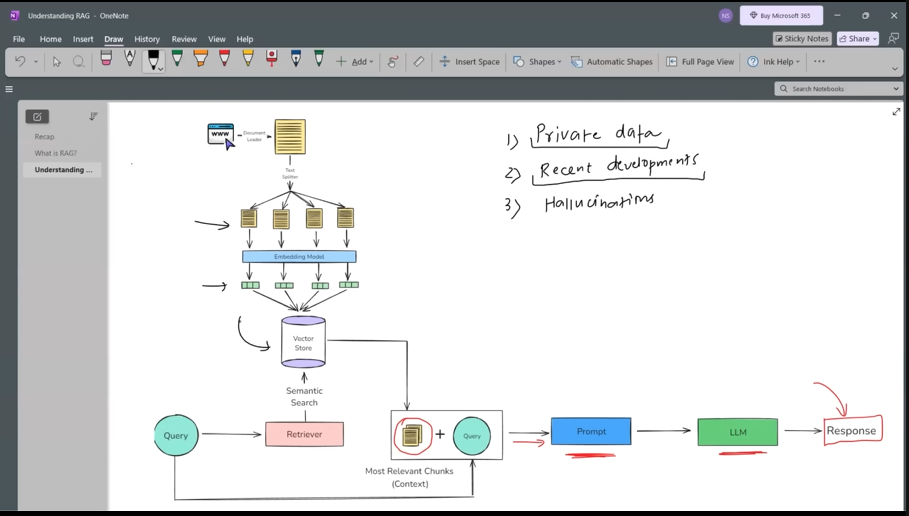

# Retrieval Augmented Generation (RAG)

## Overview

**Retrieval Augmented Generation (RAG)** is a technique that improves Large Language Models (LLMs) by combining **information retrieval** with **text generation**.

Instead of relying only on the knowledge stored inside the model during training, RAG systems **retrieve relevant information from external data sources** and provide that information as **context** to the LLM before generating an answer.

This makes the responses **more accurate, reliable, and up-to-date**.

```  **RAG** is a way to make a language models(like) smarter by giving it extra information at the time you ask your question  RAG --> Information retrieval + text generation ``` 
---

# 1. What is RAG?

RAG stands for:

**Retrieval Augmented Generation**

It combines two components:

1. **Retriever** – retrieves relevant documents from a knowledge base  
2. **Generator (LLM)** – generates the final response using the retrieved context

### Basic Idea

User Question  
↓  
Retrieve Relevant Documents  
↓  
Provide Documents as Context  
↓  
LLM Generates Final Answer  

This allows LLMs to **look up information before answering**, instead of relying only on memorized knowledge.

---

# 2. Why Do We Need RAG?

Large Language Models have several limitations.

## 1. Knowledge Cutoff

LLMs are trained on a dataset that stops at a specific date.

Example:

Model trained until **2023**

User question:

> What happened in the 2025 Olympics?

The model cannot answer correctly because it **does not have access to recent information**.

### RAG Solution

RAG retrieves **latest information from external documents**.

---

## 2. Hallucination Problem

LLMs sometimes generate **incorrect or fabricated answers** with confidence.

Example:

Question:  
Who invented LangChain?

Without RAG the model may hallucinate.

### RAG Solution

RAG retrieves information from documentation and generates **fact-based responses**.

---

## 3. No Access to Private Data

LLMs cannot access:

- company internal documents
- research papers
- enterprise knowledge bases
- confidential reports

### RAG Solution

RAG allows LLMs to use **private datasets** stored in vector databases.

---

## 4. Difficult Knowledge Updates

Updating knowledge in LLMs requires **retraining**, which is expensive and time-consuming.

### RAG Solution

Simply **add new documents to the database**.

No model retraining required.

---

# 3. RAG System Architecture

A typical RAG system contains the following components:

1. Document Loader
2. Text Splitter
3. Embedding Model
4. Vector Database
5. Retriever
6. Large Language Model (LLM)

---

# 4. RAG Pipeline Flow
Documents
↓
Document Loader
↓
Text Splitting
↓
Embedding Generation
↓
Vector Database Storage
↓
Retriever
↓
User Query
↓
Retrieve Relevant Chunks
↓
LLM
↓
Generated Answer


---

# 5. Step-by-Step RAG Workflow

## Step 1: Document Loading

Documents are collected from multiple sources such as:

- PDFs
- Websites
- Text files
- Databases
- Company documentation

Example data sources:

- LangChain documentation
- Company policy files
- Research papers

---

## Step 2: Text Splitting

Large documents cannot be processed directly by LLMs due to **token limits**.

Therefore documents are split into smaller pieces called **chunks**.

Example:

Original document = 10,000 words

Split into:

Chunk 1  
Chunk 2  
Chunk 3  
Chunk 4  

Common splitter used in LangChain:

`RecursiveCharacterTextSplitter`

---

## Step 3: Embedding Generation

Each text chunk is converted into a **vector representation**.

Example:

Text:

LangChain helps build LLM applications

↓

Vector Representation:

[0.12, 0.78, 0.44, 0.91, ...]

Embedding models capture the **semantic meaning of text**.

Popular embedding models:

- OpenAI Embeddings
- HuggingFace Sentence Transformers
- BGE Embeddings

---

## Step 4: Vector Database

The embeddings are stored in a **vector database**.

Vector databases enable **efficient similarity search**.

Popular vector databases:

- FAISS
- Chroma
- Pinecone
- Weaviate
- Milvus

Purpose:

Store embeddings and retrieve **similar vectors quickly**.

---

## Step 5: Retrieval

When a user asks a question:

1. The question is converted into an embedding
2. The vector database performs **similarity search**
3. The most relevant chunks are retrieved

Example:

User Question:

> What is LangChain?

Retriever returns:

Top 3 relevant document chunks.

---

## Step 6: Generation

The retrieved chunks are passed to the LLM as **context**.

Example prompt:

Context:
LangChain is a framework for developing applications powered by language models.

Question:
What is LangChain?

Answer using the provided context.

The LLM generates the **final response**.

---

# 6. Example of RAG

## Without RAG

User Question:

What are the admission rules of XYZ University?

LLM Response:

"I am not sure about the exact rules."

---

## With RAG

User Question:

What are the admission rules of XYZ University?

Retriever finds:

University admission documents

LLM uses the retrieved context and produces an accurate answer.

---

# 7. Example RAG Workflow in LangChain

Typical LangChain flow:

User Question  
↓  
Retriever  
↓  
Relevant Documents  
↓  
Prompt Template  
↓  
LLM  
↓  
Final Answer  

---

# 8. Applications of RAG

## Customer Support Chatbots

AI chatbots that answer questions using company documentation.

Examples:

- Amazon support bot
- Banking support assistant

---

## Enterprise Knowledge Assistants

Internal AI assistants that help employees access company information.

Examples:

- HR policy assistant
- IT support assistant

---

## Legal Document Search

Lawyers can search across large legal document collections.

Example:

Find relevant case laws.

---

## Medical Research Assistants

Doctors and researchers can search across medical journals and research papers.

---

## Academic Research Tools

Tools that search through scientific publications and summarize findings.

---

## Code Documentation Assistants

Developers can query technical documentation.

Example:

How to use LangChain retrievers?

---

# 9. Advantages of RAG

| Advantage | Explanation |
|------|------|
Reduces hallucinations | Uses factual documents |
Works with private data | Uses internal datasets |
Up-to-date knowledge | Retrieves latest documents |
No retraining required | Update documents easily |
Scalable | Works with large document collections |

---

# 10. Limitations of RAG

| Limitation | Explanation |
|------|------|
Retrieval quality matters | Poor retrieval leads to incorrect answers |
Chunking issues | Incorrect chunk size may break context |
Vector database complexity | Requires additional infrastructure |

---

# 11. RAG vs Fine-Tuning

| Feature | RAG | Fine-Tuning |
|------|------|------|
Knowledge updates | Easy | Difficult |
Training required | No | Yes |
Cost | Low | High |
Data storage | External database | Inside the model |

---

Basic Setup for RAG flow work: 

step 1: indexing is a process of prepearing knowledge base so that it can be efficiently searched at query time.
     1. Document Ingestion (Document loader)
     2. Text Chunking ( Text splits )
     3. Embeddings Generations ( for chunks --> dense vectores)
     4. Storage in Vectore Store -Stores the vectores along with the original chunk text + metadata in a vector database ( Vector store) metadata nothing but embeddings 

     use this vector store as External Knowledge base 

step 2 :Retrieval - which is th ereal time process of finfding the most relevent pieces of information from a pre-built index (Created during indexing )based on the users question. i.e  which extracts the most relevent to the query chunks to the question through different techniques  .
      1. convert query into embedding vectores .
      2. search for closest chunk embeddings to the query 
      3. return in order (ranking)
      4. top results text chunkns are  fetch as Context

step 3 : combine  the most relevent chunks (context vectors+query)  to generate prompt 

step 4: the prompt is send to the LLM for text generation task 





